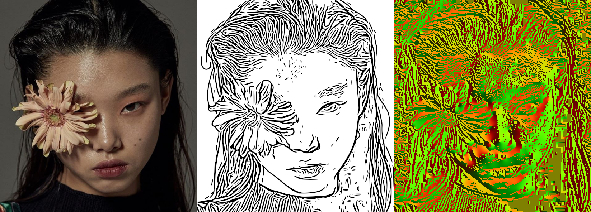
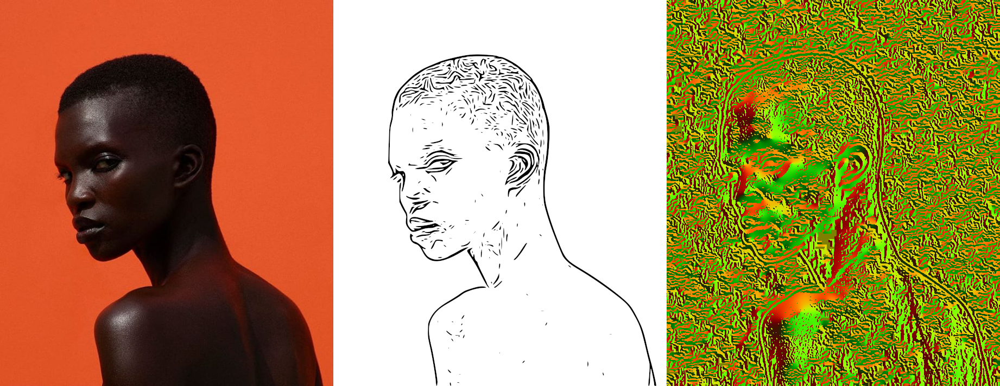

## Coherent Line Drawing

An implementation of 'Coherent Line Drawing' by Kang et al, Proc. NPAR 2007 . 

forked from [SSARCandy/Coherent-Line-Drawing](https://github.com/SSARCandy/Coherent-Line-Drawing})

## Modifications

added command-line versions :

`ETF-cli` : generate the gradientflow and edgetangentflow vector fields and writes them out as .exr 32bits files.

`CLD-cli` : process the coherent line drawing using the edgetangentflow from ETF-cli.

The original gui is called `CLD-gui`

tested on KDE Neon bionic (Ubuntu 18.04)

## Usage :

Usage : etf-cli inputfile kernelsize iterations outputgradient outputtangent

    etf-cli /path/to/input/ima.0001.png 5 3 /path/to/result/gradient.0001.exr /path/to/result/tangentflow.0001.exr
    will generate gradient.0001.exr and tangentflow.0001.exr from ima.0001.png

Usage : cld-cli inputfile inputflowfile FDoGiterations sigma_m sigma_c rho tau outputfile

    cld-cli path/to/ima.0001.png path/to/tangentflow.0001.exr 3 2 1 .98 .98 path/to/cld.0001.png
    will generate cld.0001.png from ima.0001.png and tangentflow.0001.exr
        
## Build

    sudo apt install libwxgtk3.0-gtk3-dev (Ubuntu 20.04) 
    cd path/to/Coherent-Line-Drawing
    mkdir build;cd build
    cmake
    make

### Requirement

- OpenCV (prefer 3.0 or higher)
- wxwidget (prefer 3.0 or higher)
- cmake

### Documentation

- [Original academic paper](http://citeseerx.ist.psu.edu/viewdoc/download?doi=10.1.1.108.559&rep=rep1&type=pdf)
- [Introduction in Chinese](https://ssarcandy.tw/2017/06/26/Coherent-Line-Drawing/)

> This paper presents a non-photorealistic rendering technique that
automatically generates a line drawing from a photograph.
